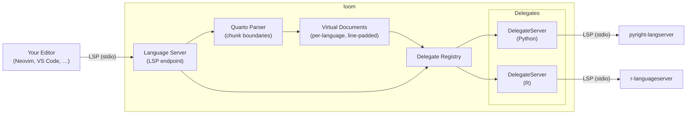

# Loom

[](https://github.com/PMassicotte/loom/actions/workflows/rust.yml)
[](LICENSE)
[](https://www.rust-lang.org)
[]()

> [!WARNING]
> This project is in early development and is not yet ready for production use. Expect breaking changes and incomplete features.

Write [Quarto](https://quarto.org/) documents and get IDE support for different languages in your notebook at the same time.

## The problem

Quarto `.qmd` files can include different code chunks (Python, R, markdown, ...) all in one document. The issue is that the editor only understands one language at a time, in the case of a Quarto document, it usually defaults to markdown. This means no autocomplete, no diagnostics, no hover documentation, and no go-to-definition for your Python or R code.

## What loom does

Loom is a language server that sits between your editor and your existing language tools. It understands the structure of a Quarto document and routes each part to the right LSP server. For example, Python chunks to pyright or pylsp, R chunks to the R language server, markdown to marksman. Your editor talks to one server, loom handles the rest.

## Works with your existing tools

Loom doesn't replace your favorite language LSP, it connects them within a single document. If you've already configured your Python or R environment, loom picks it up automatically. No new tooling to learn, no duplicate configuration.

### Editors support

Loom is designed to work with any editor that supports the Language Server Protocol (LSP). As the project evolves, it will be tested with popular editors such as Neovim, VS Code, Zed and more.

## Architecture



## Supported LSP features

- [ ] Code actions
- [x] Code completion
- [x] Diagnostics
- [ ] Document symbols
- [ ] Find references
- [ ] Formatting
- [x] Go-to-definition
- [x] Hover information
- [ ] Rename symbol
- [ ] Signature help
- [x] Text synchronization
- [ ] Workspace symbols

## Loom configuration

Loom looks for configuration files in the following order, with later entries taking precedence:

1. `~/.config/loom/loom.toml` for global settings and language configurations
2. `.loom.toml` in the current project directory which will override global settings for that project.

For each language, you can specify the command to start the LSP server, the root markers to identify the project root, and any additional settings needed for that language. Here's an example configuration:

```toml
[server]
log_level = "info"

[languages.python]
server_command = ["pyright-langserver", "--stdio"]
root_markers = ["pyproject.toml", "setup.py"]
settings = { python = { analysis = { typeCheckingMode = "basic" } } }

[languages.r]
server_command = ["R", "--slave", "-e", "languageserver::run()"]
root_markers = [".Rproj", "DESCRIPTION"]

[languages.markdown]
server_command = ["marksman", "server"]

[languages.yaml]
server_command = ["yaml-language-server", "--stdio"]

[languages.lua]
server_command = ["lua-language-server"]
```
