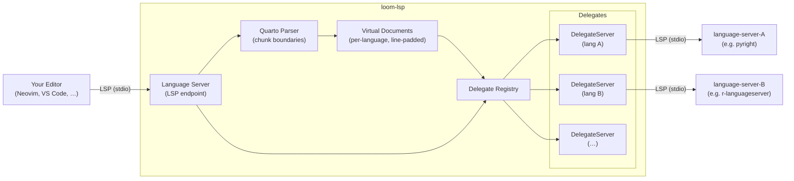

# loom-lsp

[](https://github.com/PMassicotte/loom-lsp/actions/workflows/rust.yml)
[](LICENSE)
[](https://www.rust-lang.org)
[]()

> [!WARNING]
> This project is in early development and is not yet ready for production use. Expect breaking changes and incomplete features.

Write [Quarto](https://quarto.org/) documents and get IDE support for different languages in your notebook at the same time.

## Demo


## The problem

Quarto `.qmd` files can include different code chunks (Python, R, markdown, ...) all in one document. The issue is that the editor only understands one language at a time, in the case of a Quarto document, it usually defaults to markdown. This means no autocomplete, no diagnostics, no hover documentation, and no go-to-definition for your preferred language.

## What loom-lsp does

loom-lsp is a language server that sits between your editor and your existing language tools. It understands the structure of a Quarto document and routes each part to your preferred LSP server. For example, Python chunks to pyright or pylsp, R chunks to the R language server, typescript to typescript-language-server. Your editor talks to one server, loom-lsp handles the rest.

## Installation

loom-lsp is not yet published to crates.io, but you can install it directly from GitHub using Cargo. You will need the [Rust toolchain](https://rustup.rs/) installed.

```bash
cargo install --git https://github.com/pmassicotte/loom-lsp --branch main loom-lsp
```

## Configuration

loom-lsp looks for configuration files in the following order, with later entries taking precedence:

1. `~/.config/loom-lsp/loom.toml` is the global settings and language configurations
2. `.loom.toml` in the current project directory and overrides global settings for that project

### Language configuration

For each language, specify the command to start the LSP server and, optionally, root markers to identify the project root. Here is an example configuration:

```toml
[server]
log_level = "info"  # or one of: trace | debug | info | warn | error

[languages.python]
server_command = ["pyright-langserver", "--stdio"]
root_markers = ["pyproject.toml", "setup.py"]

[languages.r]
server_command = ["R", "--slave", "-e", "languageserver::run()"]
root_markers = [".Rproj", "DESCRIPTION"]

[languages.lua]
server_command = ["lua-language-server"]

[languages.julia]
server_command = [
  "julia",
  "--startup-file=no",
  "--history-file=no",
  "-e",
  "using LanguageServer; runserver()"
]

[languages.ts]
server_command = ["typescript-language-server", "--stdio"]

# This lsp will be used for yaml code chunks but also for Quarto frontmatter
[languages.yaml]
server_command = ["yaml-language-server", "--stdio"]
```

`server_command` is required. `root_markers` is optional. When provided, loom-lsp uses these files to locate the project root for that language.

## Editor Support

loom-lsp works with any LSP-compatible editor. It is currently developed and tested with Neovim. If you would like to help test it with your editor, please [open an issue](https://github.com/PMassicotte/loom-lsp/issues).

### Neovim

```lua
vim.lsp.config("loom-lsp", {
    cmd = { "loom-lsp", "--stdio" },
    filetypes = { "quarto" },
    root_dir = vim.fs.root(0, { ".git", "_quarto.yml" }),
})

vim.lsp.enable("loom-lsp")
```

## Architecture

When your editor sends a request (completion, hover, diagnostics, etc.), loom-lsp parses the `.qmd` file into per-language virtual documents, line-padded so that line numbers stay in sync with the original file. Each language gets its own delegate process running the real language server, spawned lazily on first use. loom-lsp forwards the request to the right delegate, rewrites any URIs in the response back to the host document, and returns the result to the editor. The editor never knows there are multiple language servers involved.



## Supported LSP features

This is the current status of LSP features in loom-lsp. All core features are supported, but some are still a work in progress.

| Feature              | Status |
| -------------------- | ------ |
| Code actions         | ✅     |
| Code completion      | ✅     |
| Diagnostics          | ✅     |
| Go-to-definition     | ✅     |
| Hover information    | ✅     |
| Range formatting     | ✅     |
| Rename symbol        | ✅     |
| Signature help       | ✅     |
| Text synchronization | ✅     |
| Document symbols     | 🚧     |
| Find references      | 🚧     |
| Highlighting         | 🚧     |
| Formatting           | 🚧     |
| Workspace symbols    | 🚧     |

## Similar projects

- 🦦 [otter.nvim](https://github.com/jmbuhr/otter.nvim)
  - Neovim-specific plugin written in pure Lua with deep integration into Neovim's native LSP client and treesitter.

## Contributing

Bug reports and feedback are welcome. Please [open an issue](https://github.com/PMassicotte/loom-lsp/issues).
